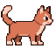

# ClaudePet

A tiny pixel-art cat that lives on your screen and reacts to what Claude Code is doing —
idle, thinking, jumping when a task finishes, curling up when it's been thinking a long
time, blocked-and-waving when it needs your input, and asleep when nothing's happened for
a while.



**Requirements:** macOS 13 (Ventura) or later, and [Claude Code](https://claude.com/claude-code).

## Install

1. Download `ClaudePet.zip` from the [Releases page](../../releases), unzip it, and drag
   `ClaudePet.app` into `/Applications`.

2. **First launch will be blocked by Gatekeeper.** This app isn't signed with a paid Apple
   Developer ID ($99/yr), so macOS doesn't recognize it and refuses to open it with a plain
   double-click. This is expected for free/independent Mac software, not a sign anything's
   wrong. To get past it:
   - Go to **System Settings → Privacy & Security**, scroll down, and click **Open Anyway**
     next to the ClaudePet block notice, then confirm **Open** when it relaunches. This is
     the reliable method on macOS Sequoia (15) and later, where Apple removed the older
     right-click shortcut.
   - On macOS Ventura/Sonoma (13–14), right-clicking (or Control-clicking) `ClaudePet.app`
     and choosing **Open** → **Open** may work as a shortcut instead.

   You only need to do this once — after the first approved launch, it opens normally.

3. A paw print (🐾) icon appears in your menu bar. The cat itself shows up floating over
   your other windows — drag it anywhere you like; its position is remembered across
   restarts.

4. **Wire it up to Claude Code.** ClaudePet only reacts to things once Claude Code is
   configured to tell it what's happening, via hooks in `~/.claude/settings.json`. Open
   that file in any text editor —

   ```bash
   open -e ~/.claude/settings.json
   ```

   (this creates it, empty, if it doesn't exist yet) — and merge in:

   ```json
   {
     "hooks": {
       "UserPromptSubmit": [
         {"hooks": [{"type": "command", "command": "~/.claudepet/bin/petsend prompt claude-code"}]}
       ],
       "PostToolUse": [
         {"matcher": "*", "hooks": [{"type": "command", "command": "~/.claudepet/bin/petsend tool claude-code"}]}
       ],
       "Stop": [
         {"hooks": [{"type": "command", "command": "~/.claudepet/bin/petsend done claude-code"}]}
       ],
       "Notification": [
         {"hooks": [{"type": "command", "command": "~/.claudepet/bin/petsend notify claude-code"}]}
       ],
       "PreToolUse": [
         {"matcher": "AskUserQuestion", "hooks": [{"type": "command", "command": "~/.claudepet/bin/petsend notify claude-code"}]}
       ]
     }
   }
   ```

   **Note on the "!" alert:** it only fires for `AskUserQuestion` (Claude explicitly asking
   you something) — not for genuine tool-permission prompts. Claude Desktop routes
   permission approvals through its own native dialog via a separate mechanism that
   doesn't go through Claude Code's `Notification` hook, so there's currently no way for
   ClaudePet to detect "waiting on your permission" specifically. (We tried widening the
   hook to fire on every tool call as a rough proxy; it just meant the alert fired
   constantly, including for calls that never needed approval, so it got reverted.)

   **If you already have hooks configured**, merge these entries into your existing
   `hooks` object rather than replacing the file — don't clobber hooks you already have
   for other tools. `~/.claudepet/bin/petsend` is installed automatically the first time
   you launch ClaudePet.app, so this step just needs the JSON above; nothing else to build
   or copy.

5. Restart any running Claude Code sessions (hooks are read at session start) and try a
   prompt — the cat should show thinking dots, then react when the turn finishes.

If you also use **Cowork** (Claude Desktop's agent mode), no extra setup is needed —
ClaudePet detects Cowork activity separately, automatically, once it's running.

## Menu bar / right-click options

Click the 🐾 icon, or right-click the cat itself, for:
- **Show/Hide Pet**
- **Sleep After** — how long without activity before it falls asleep (1/5/15/30 min)
- **Launch at Login**
- **Quit ClaudePet**

Click the cat to wake it (if asleep) or make it jump. A blocked/alert state (waiting on
you) clears itself once you respond, or you can click to dismiss it early.

## Uninstall

1. If you enabled Launch at Login, toggle it off first (menu bar or right-click menu),
   while the app is still running, so macOS's login items registration is cleanly removed.
2. Quit ClaudePet (menu bar → Quit, or right-click the cat → Quit).
3. Delete `/Applications/ClaudePet.app`.
4. Delete `~/.claudepet/` (the socket dir and installed `petsend` CLI).
5. Remove the hook entries you added to `~/.claude/settings.json`.

## Building from source

Requires Xcode (free from the App Store) and [XcodeGen](https://github.com/yonaskolb/XcodeGen)
(`brew install xcodegen`).

```bash
xcodegen generate
xcodebuild -project ClaudePet.xcodeproj -scheme ClaudePet -configuration Release build
```

The built app (with `petsend` embedded) lands in `build/Build/Products/Release/ClaudePet.app`.

See [PET_PLAN.md](PET_PLAN.md), [ART_SPEC.md](ART_SPEC.md), and [ROADMAP.md](ROADMAP.md) for
the design/build history and what's planned next.
